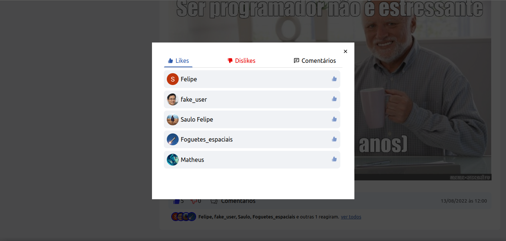
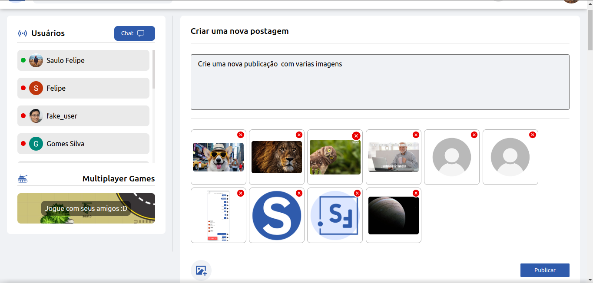
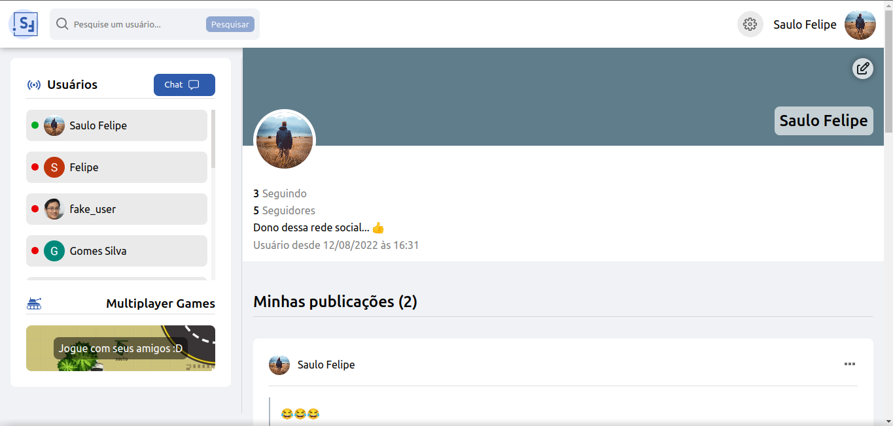
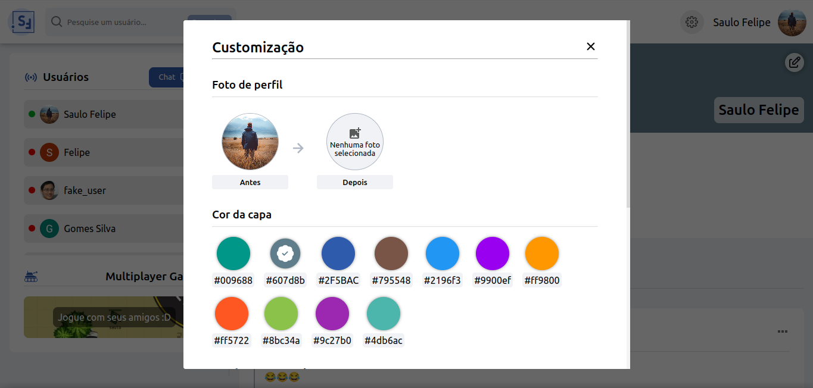
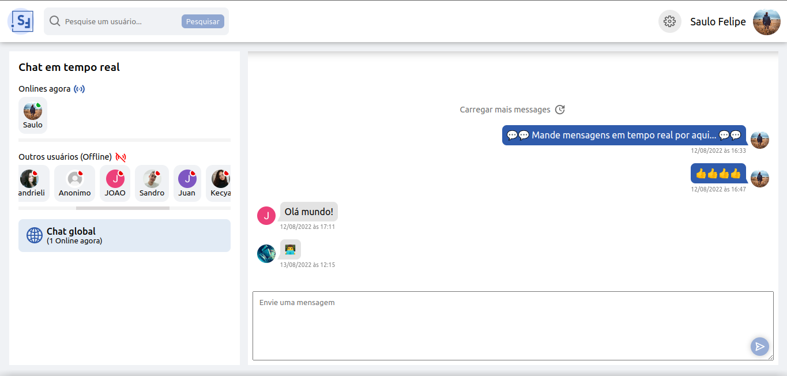
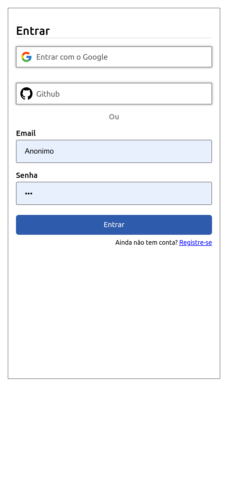
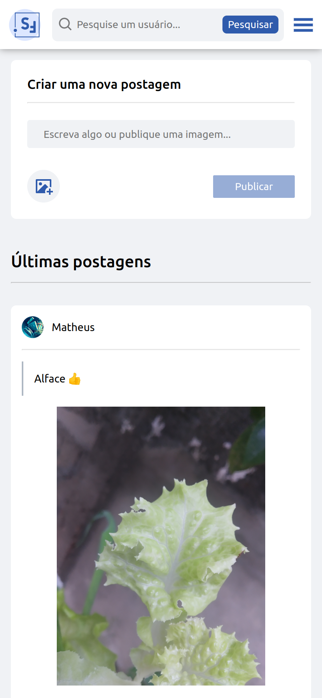

## Índice

* [Preview](#preview)
* [Sobre](#sobre)
* [Funcionalidades](#funcionalidades)
* [Layout](#layout)
* [Tecnologias](#tecnologias)
* [Autor](#autor)
* [Licença](#licenca)

------------------------------------

## 💻 Sobre 
Uma simples rede social :).
 

------------------------------------

## 🚀 Preview 

-> https://rede-social-saulo-felipe.vercel.app/

------------------------------------

## ⚙️ Funcionalidades 
1. ✅ Responsivo
2. ✅ Postagens
3. ✅ Likes, dislikes e comentários
4. ✅ Perfis de usuário dinâmico
5. ✅ Sistema de autenticação com Google, Github e Email
6. ✅ Chat em tempo real
7. ✅ Seguir usuários e ser seguido 

------------------------------------

## 🎨 Layout 

*O Layout completo do site está disponível <a href="https://rede-social-saulo-felipe.vercel.app">aqui</a>.

    
    

    
    

------------------------------------

## 🤖 Tecnologias 

Nesta rede social, foram utilizadas as seguintes stacks: 

* HTML5 
* CSS3 
* Sass 
* Javascript 
* Typescript 
* Nodejs 
* Nextjs 
* PostgreSQL 
* websocket 

------------------------------------

## 👨 Autor 

➡️ Desenvolvido por <strong>eu</strong> mesmo 🧑‍💻.

------------------------------------

## 📜 Licença 

Todos os direitos reservados ©Copyright - Saulo Felipe

